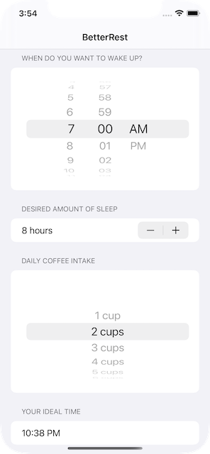

# Better Rest (SwiftUI)

The actual app is designed to help coffee drinkers get a good night’s sleep by asking them three questions:

* When do they want to wake up?
* Roughly how many hours of sleep do they want?
* How many cups of coffee do they drink per day?

## Screenshot

| Screenshot 01 |
| ------------- |
|  |

---

**MIT License**